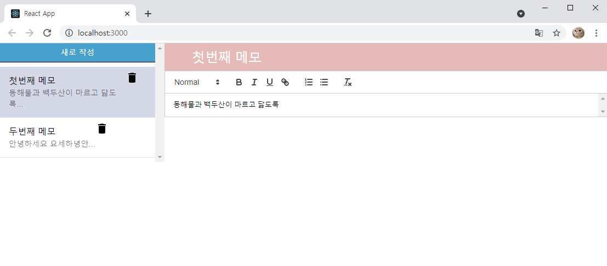
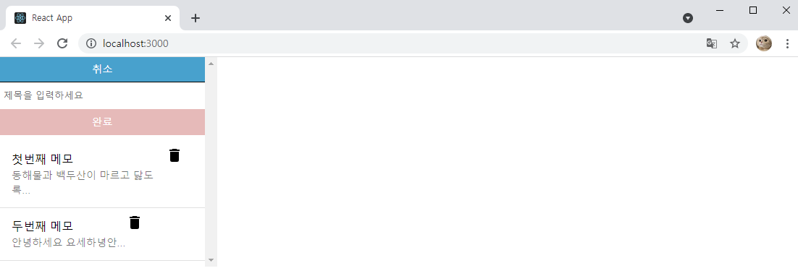
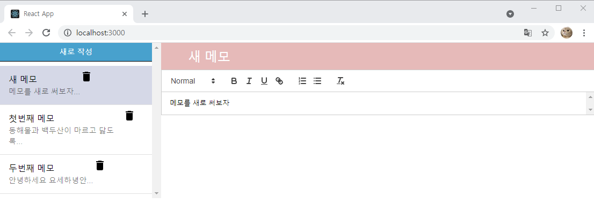
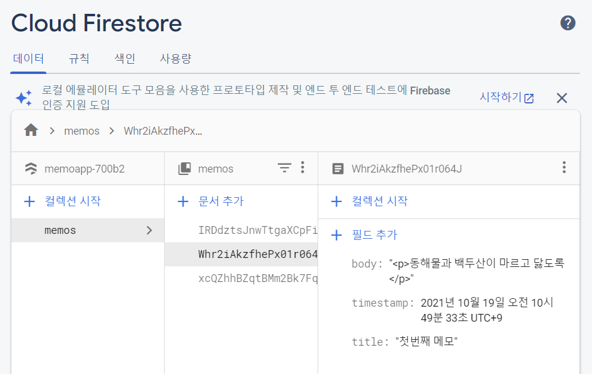

# MemoApp with react
- 왼편엔 sidebar 컴포넌트를 사용하여 메모 리스트가 출력되게, 오른편에는 react-quill을 사용하여 텍스트 작성이 가능함. 
- firebase 연동으로 페이지에 입력한 메모들은 cloud firebase에서 확인 가능.

## 메인페이지 화면

## 메모 추가 과정

1. 왼쪽 상단의 **새로작성** 버튼 클릭 후 제목 입력

 2. sidebar의 메모 클릭 후 메모 내용 작성

## firebase 화면

- 추가된 메모 포함 총 3개의 메모가 제대로 들어가있는 것을 확인할 수 있음.
